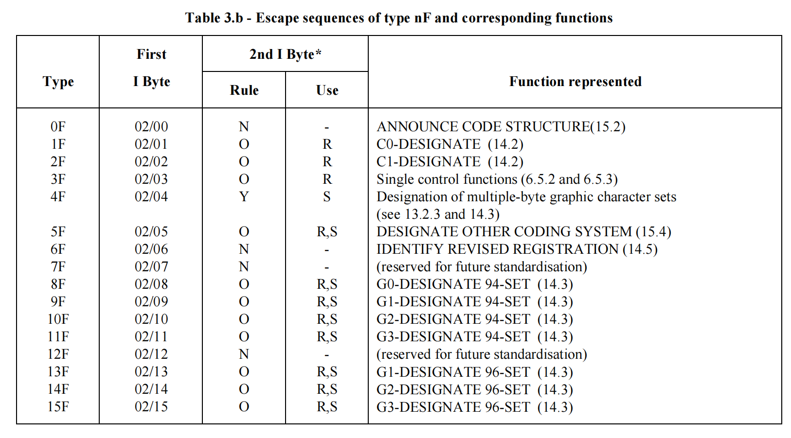
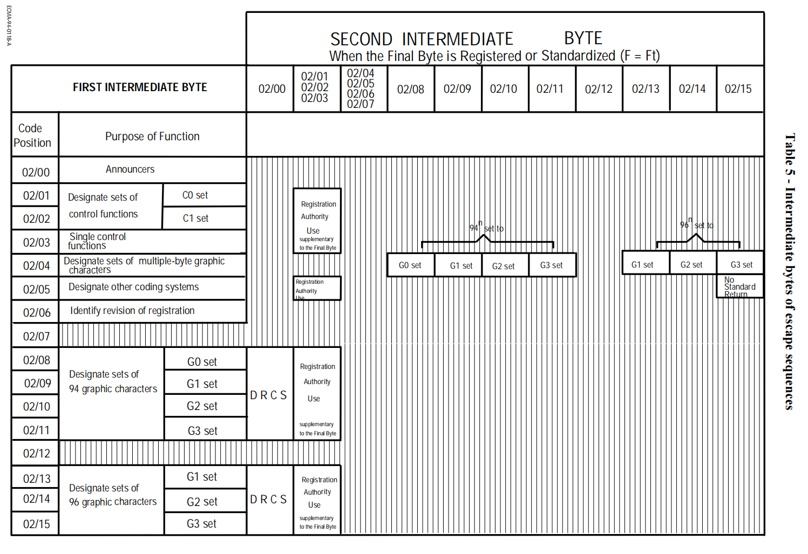
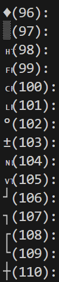
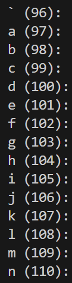

## Problem Description

When `i` equals 27, using the `printf("%i(%d)", i, i);` statement to output characters causes the terminal's character set to change. This happens because **ASCII value 27** corresponds to the **ESC (Escape)** character, which is used to trigger **escape sequences** in the terminal. Escape sequences are special sequences that control the behavior of the terminal, such as changing the character set, moving the cursor, or setting colors.

When the program prints `i = 27`, it outputs the `ESC` character, and the character immediately following it (in this case, the parenthesis `'('(02/08)`) is interpreted by the terminal as part of an escape sequence, rather than as a normal character. This leads to unexpected changes in the terminal, such as modifying the character set or display behavior.




## Solution

To prevent the case above
**Add a space between the character and the parenthesis**: By placing a space between the character and the parenthesis, so that the terminal's character set will not change to `G0-DESIGNATE 94-SET`.

### Modified Code

```c
printf("%i (%d)", i, i);
```

### Example Output

<div style="display: flex; justify-content: space-around; align-items: center;">
    <div style="text-align: center;">
        
        <p>Before</p>
    </div>
    <div style="text-align: center;">
        
        <p>After</p>
    </div>
</div>